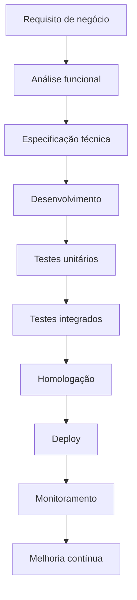

<div align="center">


### Desenvolvedor e Analista Funcional especializado em Oracle BRM e Oracle Cloud Infrastructure

<br>

<a href="https://github.com/SEU_USUARIO_GITHUB">
  
</a>

<a href="https://www.linkedin.com/in/luiz-fernando-alves-363165225/">
  
</a>

<a href="mailto:luizfernandolg51@gmail.com">
  
</a>

<a href="https://wa.me/5581997357533">
  
</a>

</div>

---

## 👨‍💻 Sobre mim

Olá! Meu nome é **Luiz Fernando**.

Sou **Desenvolvedor e Analista Funcional**, com foco no ecossistema **Oracle BRM — Billing and Revenue Management**, **Oracle Database** e **Oracle Cloud Infrastructure — OCI**.

Atuo conectando necessidades de negócio com soluções técnicas, participando desde o levantamento e análise de requisitos até o desenvolvimento, testes, implantação, sustentação e documentação da solução.

Tenho interesse especial em projetos relacionados a faturamento, tarifação, gestão de receitas, integração de sistemas, cloud computing, automação e modernização de aplicações corporativas.

```text
🔹 Oracle BRM Development
🔹 Análise Funcional
🔹 Billing e Revenue Management
🔹 Oracle Cloud Infrastructure
🔹 Oracle Database, SQL e PL/SQL
🔹 Integração de sistemas e APIs
🔹 Troubleshooting e análise de incidentes
🔹 Documentação funcional e técnica
```

---

## 🎯 Resumo profissional

```yaml
nome: Luiz Fernando
perfil: Desenvolvedor e Analista Funcional
especialidades:
  - Oracle BRM
  - Billing e Revenue Management
  - Oracle Cloud Infrastructure
  - Oracle Database
  - Integração de Sistemas
  - Análise Funcional

objetivo:
  Desenvolver soluções eficientes, escaláveis e alinhadas
  às necessidades técnicas e estratégicas do negócio.
```

---

## 🧩 Oracle BRM

<div align="center">


</div>

### Competências em Oracle BRM

* Arquitetura e componentes do Oracle BRM
* Processos de billing e faturamento
* Charging, rating e tarifação
* Gestão de contas e serviços
* Catálogo de produtos, planos e ofertas
* Ciclo de vida de clientes
* Invoicing e geração de faturas
* Pagamentos, cobranças e ajustes financeiros
* Collections e gerenciamento de débitos
* Desenvolvimento e customização de Opcodes
* Manipulação de FLISTs
* Estruturas POID e objetos BRM
* Desenvolvimento de aplicações MTA
* Customização de políticas
* Facilities Modules
* Data Manager
* Processos batch
* Integração com sistemas externos
* Análise de logs
* Troubleshooting
* Sustentação corretiva e evolutiva
* Análise de incidentes em produção
* Migração e tratamento de dados

---

## ☁️ Oracle Cloud Infrastructure

<div align="center">


</div>

### Competências em OCI

* Compute Instances
* Virtual Cloud Network — VCN
* Subnets públicas e privadas
* Route Tables
* Security Lists
* Network Security Groups
* Load Balancer
* Object Storage
* Block Volume
* Oracle Database Cloud Services
* Identity and Access Management — IAM
* Compartments
* Groups e Policies
* Monitoring
* Logging
* Notifications
* Vault e gerenciamento de secrets
* Backup e recuperação
* Alta disponibilidade
* Escalabilidade de aplicações
* Infraestrutura como código
* Terraform
* Deploy de aplicações em nuvem
* Análise de desempenho
* Controle e otimização de custos

---

## 🛠️ Tecnologias e ferramentas

<div align="center">

### Linguagens


### Banco de dados e integração


### DevOps e infraestrutura


### Gestão, documentação e testes


</div>

---

## 📋 Análise funcional

Como Analista Funcional, atuo na comunicação entre as áreas de negócio, desenvolvimento, infraestrutura, testes e operações.

### Principais competências

* Levantamento de requisitos
* Análise de requisitos funcionais e não funcionais
* Entendimento de processos de negócio
* Mapeamento de processos AS-IS e TO-BE
* Tradução de regras de negócio em requisitos técnicos
* Criação de especificações funcionais
* Elaboração de histórias de usuário
* Definição de critérios de aceite
* Análise de impacto
* Gap Analysis
* Modelagem de fluxos e processos
* Validação de soluções técnicas
* Planejamento de testes
* Execução de testes funcionais
* Testes integrados
* Apoio durante UAT
* Acompanhamento de deploys
* Gestão de incidentes
* Análise de causa raiz — RCA
* Documentação de processos
* Comunicação com stakeholders
* Suporte às equipes técnicas e de negócio

---

## 🧠 Skills e competências

<table>
  <tr>
    <td width="50%" valign="top">

### Hard skills

* Oracle BRM
* Oracle Database
* SQL e PL/SQL
* C e C++
* Java
* Shell Script
* Billing
* Charging e Rating
* Revenue Management
* Oracle Cloud Infrastructure
* Linux
* APIs REST
* Web Services SOAP
* Integração de sistemas
* Git e GitHub
* Docker
* Troubleshooting
* Análise de logs
* Documentação técnica
* Metodologias ágeis

</td>
    <td width="50%" valign="top">

### Soft skills

* Comunicação clara
* Pensamento analítico
* Resolução de problemas
* Visão sistêmica
* Organização
* Planejamento
* Proatividade
* Trabalho em equipe
* Adaptabilidade
* Colaboração
* Gestão de prioridades
* Atenção aos detalhes
* Comprometimento
* Orientação a resultados
* Senso de responsabilidade
* Aprendizado contínuo
* Relacionamento com stakeholders
* Capacidade de tomada de decisão

</td>
  </tr>
</table>

---

## 🔄 Minha forma de trabalhar


---

## 🏗️ Ciclo de desenvolvimento



---

## 🎯 Áreas de interesse

* Oracle BRM Development
* Oracle BRM Functional Analysis
* Billing and Revenue Management
* Oracle Cloud Infrastructure
* Arquitetura de soluções
* Cloud Computing
* Integração de sistemas
* Microsserviços
* Automação de processos
* DevOps
* CI/CD
* Observabilidade
* Segurança em cloud
* Modernização de sistemas legados
* Alta disponibilidade
* Engenharia de software

---

## 📚 Atualmente estudando

```text
☁️ Arquitetura de soluções em Oracle Cloud Infrastructure
🏗️ Infraestrutura como código com Terraform
🐳 Containers com Docker e Kubernetes
🔄 CI/CD e automação de deploys
📡 Integrações orientadas a eventos
🔐 Segurança de aplicações e ambientes cloud
📊 Observabilidade, monitoramento e performance
🧩 Desenvolvimento e arquitetura Oracle BRM
```

---


---

## 📫 Contato

<div align="center">

| Canal        | Contato                                                                           |
| ------------ | --------------------------------------------------------------------------------- |
| **E-mail**   | [luizfernandolg51@gmail.com](mailto:luizfernandolg51@gmail.com)                   |
| **WhatsApp** | [+55 81 99735-7533](https://wa.me/5581997357533)                                  |
| **LinkedIn** | [Luiz Fernando Alves](https://www.linkedin.com/in/luiz-fernando-alves-363165225/) |
| **GitHub**   | [luizarrow3](https://github.com/luizarrow3)                       |

</div>

---

<div align="center">

### Transformando requisitos de negócio em soluções técnicas eficientes, escaláveis e confiáveis.

<br>


<br><br>


</div>


